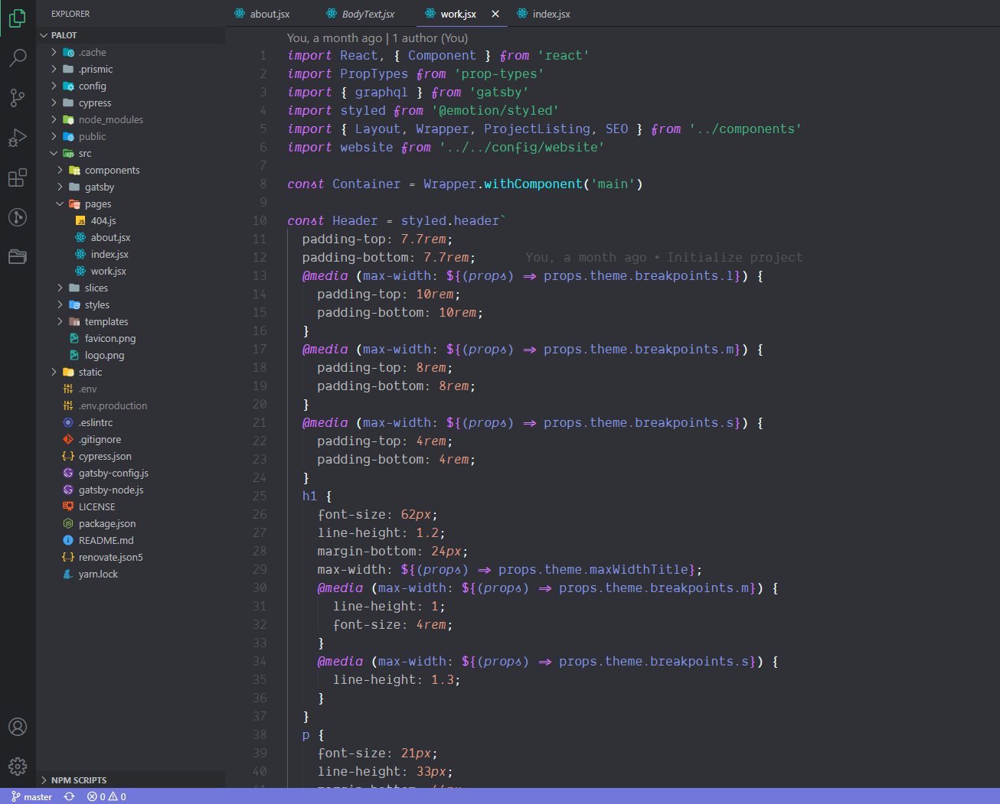

# Kulay Dark 🦹‍♂️



## Installation

1. Open the **Extensions** sidebar in VS Code
2. Search for `Kulay`
3. Click **Install**
4. Open the **Command Palette** with `Ctrl+Shift+P` or `⇧⌘P`
5. Select **Preferences: Color Theme** and choose a Kulay Dark.

## Personalization

Below is my settings recommendations.

```
{
  "editor.fontLigatures": true,
  "editor.fontWeight": "400",
  "editor.fontSize": 18,
  "explorer.openEditors.visible": 0,
  "terminal.integrated.showExitAlert": false,
  "workbench.tree.renderIndentGuides": "onHover",
  "workbench.sideBar.location": "left",
  "workbench.startupEditor": "newUntitledFile",
  "editor.formatOnSave": true,
  "editor.fontFamily": "Dank Mono",
  "terminal.integrated.fontFamily": "Dank Mono",
  "window.zoomLevel": 0,
  "editor.minimap.enabled": false,
  "editor.renderLineHighlight": "none",
  "breadcrumbs.enabled": false,
}
```

## Contributing

Feel free to contribute. Report issues found and help make changes.